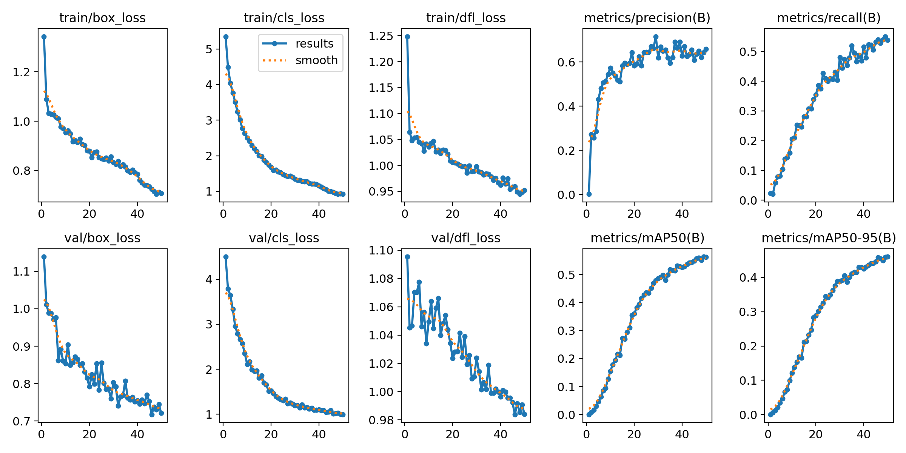

# Shelf product detection, Hackology II solo redo

Object detection on photos of store shelves. There are 369 classes and each class is one specific product. The metric is mAP@0.5 and the annotations use the COCO format.

This repository is my solo redo of the Hackology II hackathon task, which ran on 23 and 24 May 2026. I am doing it again alone so that I can explain every step. The plan was a budget of 24 hours of net work. I stopped timing during the experiments and most likely went over it. The score matters less than understanding where it comes from.

## Current state

The best run so far is A3 with mAP@0.5 of 0.530. I measured it on 300 real photos held out from training, using my own validation split. It is a local number and not a leaderboard score. The hackathon leaderboard no longer accepts submissions.

| Run | The one change | mAP@0.5 |
|---|---|---|
| A | baseline with Ultralytics defaults | 0.024 |
| A2 | learning rate set explicitly | 0.455 |
| A3 | image size 960 instead of 640 | 0.530 |

The synthetic images are not used yet. Experiments B and C, which add them, have no result. [`RESULTS.md`](RESULTS.md) is the source of truth for every score in this README.

## Task and data

- The training set has 3904 images. 1123 are real photos and 2781 are synthetic renders.
- Each image has a `source_dataset` field in `annotations.json`. The values `SIDG_TRAIN` and `SIDG_SYNTH_TRAIN` mark synthetic images.
- The test set contains real photos only and has no annotations.
- Only products from the 369 classes have boxes. Other products on the same shelf have none, so the model learns them as background.

The data is not in this repository. It comes from the organizers and the rules for publishing it are not confirmed. [`taxonomy.json`](taxonomy.json) and [`test_images.json`](test_images.json) are the organizers' files.

## Method

### Validation split

I took 300 of the 1123 real photos as the validation set, with `random.seed(2)`. The ids are frozen in [`splits/val_image_ids.json`](splits/val_image_ids.json), which is tracked in git. The other 823 real photos are the training set for every run so far.

The split is frozen because a score only means something next to another score on the same photos. Changing the split invalidates every row in the results table. Validation uses real photos only because the test set is real photos only.

The 300 validation photos carry 4097 ground-truth boxes.

### Pipeline

1. [`scripts/validation/data_split.py`](scripts/validation/data_split.py) samples the 300 validation ids and saves them.
2. [`scripts/evaluation/build_val_ground_truth.py`](scripts/evaluation/build_val_ground_truth.py) cuts the COCO annotations down to those 300 photos and writes the ground truth for evaluation.
3. [`scripts/training/convert_coco_to_yolo.py`](scripts/training/convert_coco_to_yolo.py) writes the train and validation image lists and one YOLO label file per photo. COCO boxes are `[x, y, width, height]` in pixels from the top-left corner. YOLO wants the box center and size as fractions of the image size. COCO class ids run from 1 to 369 and YOLO indices from 0 to 368, so the script subtracts 1. Validation photos are excluded from the training list.
4. [`scripts/training/make_dataset_yaml.py`](scripts/training/make_dataset_yaml.py) writes the dataset config that Ultralytics reads.
5. [`scripts/training/train.py`](scripts/training/train.py) fine-tunes the model on the Mac. The Kaggle runs make the same `model.train` call from a notebook in [`notebooks/training/`](notebooks/training/), with `device=0`.
6. [`scripts/training/predict_val.py`](scripts/training/predict_val.py) loads `best.pt` from the run folder, predicts on the 300 validation photos at the image size used in training and converts the output back to COCO format. It adds 1 to the class index and turns corner coordinates into `[x, y, width, height]`.
7. [`scripts/evaluate_map.py`](scripts/evaluate_map.py) scores the predictions against the ground truth with `pycocotools`.

### Training setup

Shared by every run:

| Setting | Value |
|---|---|
| Model | YOLOv8n, pretrained weights `yolov8n.pt` |
| Library | Ultralytics 8.4.51 |
| Training data | 823 real photos |
| Batch size | 16 |
| Epochs | 50 |
| Other | `cache="ram"` |

Different per run:

| Run | Optimizer | Image size | Hardware | Training time |
|---|---|---|---|---|
| A | `optimizer=auto`, which resolved to AdamW with learning rate 2.7e-05 | 640 | Mac M4, 24 GB RAM, `device="mps"` | about 58 min |
| A2 | AdamW with `lr0=0.001`, set explicitly | 640 | Mac M4, `device="mps"` | about 64 min |
| K640 | as A2 | 640 | Kaggle, Tesla T4, `device=0` | about 12 min |
| A3 | as A2 | 960 | Kaggle, Tesla T4, `device=0` | about 26 min |

The Kaggle runs used Python 3.13.15 and PyTorch 2.11.0 with CUDA. The Mac runs used Python 3.14 on MPS.

### How the score is computed

`predict_val.py` runs the model with a confidence threshold of 0.001. mAP is computed from the whole ranking of detections, so the low-confidence boxes are needed too.

`evaluate_map.py` runs `COCOeval` from `pycocotools`. The number I report is the AP at IoU 0.50 from its summary. Every run is scored this way on the Mac, the ones trained on Kaggle too.

Ultralytics prints its own mAP50 during validation. I use it as a cross-check only.

| Run | `evaluate_map.py` | Ultralytics | Gap |
|---|---|---|---|
| A | 0.024 | 0.0258 | about 7% |
| A2 | 0.455 | 0.4987 | 8.8% |
| K640 | 0.450 | 0.4831 | 6.8% |
| A3 | 0.530 | 0.5620 | 5.7% |

The gap is not constant, so one number cannot be converted into the other. The two evaluators agree on the differences between runs: A3 minus K640 is 8.0 points in mine and 7.9 in Ultralytics. Scoring the same weights twice gave identical numbers, so the scoring adds no noise of its own.

## Experiments

One experiment is one change. Every row is scored on the same 300 validation photos.

| ID | What changed | mAP@0.5 | Training time |
|---|---|---|---|
| A | Baseline. Real photos only, YOLOv8n, image size 640, 50 epochs, Ultralytics defaults | 0.024 | about 58 min, Mac |
| A2 | A with the optimizer set explicitly to AdamW, `lr0=0.001` | 0.455 | about 64 min, Mac |
| K640 | Control, not an experiment. A2 retrained on a Kaggle T4 with no setting changed | 0.450 | about 12 min, Kaggle T4 |
| A3 | K640 with image size 960 | 0.530 | about 26 min, Kaggle T4 |
| B | A2 plus synthetic images mixed into training | planned | |
| C | Pretrain on synthetic images, fine-tune on real photos | planned | |

`cache="ram"` can make runs slightly non-deterministic, so differences below about one point are noise. Every variant has one run, so I do not know the real spread between runs.

### What run A showed

Run A ended at 0.024. The model was undertrained, not overfitted. Its mAP50 rose almost linearly until epoch 50 and the class loss was still falling, from 6.5 to 4.1. The box loss and the dfl loss were flat from about epoch 15.

AP at IoU 0.75 was 0.022, close to the 0.024 at IoU 0.5. When the model found an object, the box was well placed. Classification was the bottleneck.

The cause was the learning rate. With `optimizer=auto` Ultralytics ignores `lr0=0.01` and picked AdamW with a learning rate of 2.7e-05, about 370 times smaller.

### What run A2 showed

Run A2 changed only the optimizer setting. mAP@0.5 went from 0.024 to 0.455, about 19 times higher. Recall went from 0.05 to 0.46. The class loss at epoch 19 was 1.89 instead of 5.06.

- Final precision was 0.63 and recall 0.46, both from the Ultralytics validation pass.
- AP at IoU 0.75 is 0.422, close to 0.455. The remaining error is mostly classification, not box placement.
- The run is not overfitted. Validation class loss is 1.20 against 1.05 in training, and it was still falling in the last epochs.
- Gains flatten at the end while the learning rate decays to 3e-05. Whether more epochs would help is untested.

### Why image size came next

At image size 640 a bottle is about 24 pixels wide. At 960 it is about 36 pixels. My hypothesis was that more pixels per bottle make labels readable and help classification, the weak part in runs A and A2. The Mac was already at about 20.7 GB of 24 GB at 640, so the run went to Kaggle.

### The control run K640

Moving to Kaggle changes the hardware, the backend (CUDA instead of MPS) and the Python version, on top of the image size. To keep the two apart I first repeated A2 on Kaggle with no setting changed. The `args.yaml` files of A2 and K640 differ only in `device`.

K640 scored 0.450 against 0.455 on the Mac. The 0.5 point difference is below the noise level, so the platform does not change the score measurably. It changes the time: 711 seconds of training against 3835 on the Mac. A3 is compared against K640, not against A2.

### What run A3 showed

A3 changed only the image size. mAP@0.5 went from 0.450 to 0.530, which is 8.0 points for 2.2 times the training time.

- AP at IoU 0.75 rose from 0.417 to 0.500.
- Average recall rose from 0.489 to 0.551. This is the AR line of the COCO summary with at most 100 detections per image.
- The class loss fell the most, from 1.11 to 0.92 in training. The box loss fell from 0.81 to 0.71 and the dfl loss stayed at 0.95. This fits the hypothesis about readable labels and does not prove it. Losses at different image sizes compare only roughly, because the model scores 18900 candidate boxes per image at 960 and 8400 at 640.
- The run is not overfitted. Validation class loss is 0.99 against 0.92 in training and was still falling.
- mAP50 gained 3.6 points over the last 10 epochs in the Ultralytics validation. Whether more epochs help is untested.
- A3 returned fewer boxes than K640 at confidence 0.001, 29103 against 36424, while finding more objects. The number of boxes says nothing about quality. Why it fell is a hypothesis in [`OBSERVATIONS.md`](OBSERVATIONS.md).



The figure is `results.png` as Ultralytics wrote it for A3. The top row has the three training losses, precision and recall. The bottom row has the validation losses, mAP50 and mAP50-95. The mAP50 in the figure is the Ultralytics number, 0.562 at epoch 50. The table uses 0.530 from `evaluate_map.py`. The kink in the training losses at epoch 41 is mosaic augmentation switching off for the last 10 epochs.

### What is next

Every run so far trained on the 823 real photos. The 2781 synthetic renders are unused. B mixes them into training and C pretrains on them, both scored on the same 300 real photos. The open question is whether renders help on real photos.

## Problems observed

The full log with evidence is in [`OBSERVATIONS.md`](OBSERVATIONS.md). The ones worth knowing:

- **Learning rate chosen automatically.** Described above. Status: measured and confirmed by run A2.
- **Slow first epoch.** About 6.3 seconds per batch of 16. Ultralytics uses 0 dataloader workers on MPS, so one thread decoded 12-megapixel JPEGs and built mosaics. With `cache="ram"` a batch takes about 0.8 to 1 second. Status: resolved.
- **Memory pressure on the Mac.** During run A the training process held about 20.7 GB of 24 GB and swap was about 8.3 GB. Image size 960 at batch 16 does not fit comfortably, so A3 ran on Kaggle. Status: measured.
- **Duplicate ground-truth boxes.** 94 of the 4097 validation boxes are exact duplicates. Ultralytics drops them and `pycocotools` keeps them. Status: measured.
- **Two evaluators, two numbers.** `evaluate_map.py` is lower than the Ultralytics mAP50 by 5.7% to 8.8%, depending on the run. From the source code of both libraries, the likely main cause is that Ultralytics validation keeps every class above the confidence threshold for each box (`multi_label=True`), while `predict_val.py` keeps only the best class per box. The duplicate ground-truth boxes and a different interpolation of the precision-recall curve may add to it. The COCO limit of 100 detections applies per image and per class, so it does not bind here. Status: hypothesis from reading the code, not tested.
- **The scoring script overwrites its output.** `predict_val.py` writes `splits/val_predictions.json` on every call and prints the box count without the weights or the image size. A pasted log does not say which run it belongs to, so I scored one run at a time and wrote the number down before the next. Status: open.
- **Zero predictions from a smoke model.** After 3 epochs on 10% of the data, `predict_val.py` returned 0 boxes at confidence 0.001. Status: hypothesis.
- **Pipeline check with the pretrained model.** `yolov8n.pt` without fine-tuning gave 89515 boxes for the 300 photos and mAP 0.000, as expected, because COCO classes do not match the 369 products. That proved the file format. The coordinates and the class shift were confirmed later, when run A gave a non-zero score close to the Ultralytics one.
- **Python version.** `pyproject.toml` allows Python 3.11 and newer. `build_val_ground_truth.py` uses an f-string with nested double quotes, which works on 3.12 and newer only. My environment runs 3.14. Status: open, minor.

## Limitations

- **Local validation only.** The only number is mAP@0.5 on my own split. The original team's leaderboard score of about 0.6 is from memory and unverified, so I do not use it as a baseline.
- **One run per variant.** No run was repeated, so the spread between runs is unknown. I treat differences below about one point as noise.
- **Validation covers about 237 of 369 classes.** 10 classes appear only in validation. 45 appear only in real training photos and are not evaluated. Many classes have 1 or 2 validation boxes, so their AP is noisy.
- **17 classes have no training boxes at all.** About 70 appear only on synthetic images.
- **Duplicates lower the ceiling.** A model returns one box per object, so with duplicate ground truth the achievable mAP is slightly below 1.
- **Unlabeled products.** A detection on a product outside the 369 classes counts as a false positive. This matches how the test set is scored, but it limits precision.
- **Synthetic images are renders, not photos.** No run so far uses them.
- **Few experiments.** This is a solo redo planned for 24 hours of net work. There is no extensive hyperparameter search.

[`LIMITATIONS.md`](LIMITATIONS.md) has the longer version.

## How to reproduce

You need the dataset under `data/train/`. It is not part of this repository.

```bash
uv sync
```

Run the scripts from the repository root, in this order:

```bash
uv run python scripts/evaluation/build_val_ground_truth.py
uv run python scripts/training/convert_coco_to_yolo.py
uv run python scripts/training/make_dataset_yaml.py
uv run python scripts/training/train.py
uv run python scripts/training/predict_val.py
uv run python scripts/evaluate_map.py
```

- [`splits/val_image_ids.json`](splits/val_image_ids.json) is already in the repository. Do not run `data_split.py` again unless you mean to change the split.
- `train.py` uses `device="mps"`. Change it on other hardware. The run name and the settings are constants at the top of the file.
- `predict_val.py` has the path to the weights and the image size as constants. Point it at the run you want to score and set the image size used in training.
- `evaluate_map.py` prints the COCO summary. The second line is the AP at IoU 0.50.

### Runs on Kaggle

K640 and A3 were trained with the two notebooks in [`notebooks/training/`](notebooks/training/). A notebook clones this repository, copies the images from a private Kaggle dataset, runs the same two preparation scripts and calls `model.train` with the A2 settings and `device=0`. The notebooks differ only in `NAME` and `IMGSZ`. Their cell outputs hold the full training logs.

The dataset is private, so the notebooks will not run for anyone else as they are. I downloaded `best.pt` from the notebook output and scored it on the Mac with `predict_val.py` and `evaluate_map.py`.

### Helper scripts

Three helper scripts are not part of the main path. [`scripts/evaluation/make_perfect_predictions.py`](scripts/evaluation/make_perfect_predictions.py) builds predictions from the ground truth, to see what the evaluator prints for a perfect answer. [`scripts/training/draw_labels.py`](scripts/training/draw_labels.py) draws the YOLO labels of one photo to check the conversion. [`scripts/validation/val_image_ids.py`](scripts/validation/val_image_ids.py) prints how many classes appear in each part of the split.

## Repository layout

```
RESULTS.md               results table, source of truth for scores
OBSERVATIONS.md          log of problems with evidence and status
LIMITATIONS.md           limits of the measurement and the data
scripts/validation/      validation split and class coverage check
scripts/training/        label conversion, dataset config, training, prediction on validation
scripts/evaluation/      ground truth for the validation photos, perfect-answer check
scripts/evaluate_map.py  mAP with pycocotools
splits/val_image_ids.json  the frozen 300 validation ids
predict.py               organizers' prediction CLI, see below
notebooks/               notebooks from the organizers' template
notebooks/training/      Kaggle notebooks for runs K640 and A3, with training logs
assets/a3-results.png    training curves of run A3, written by Ultralytics
taxonomy.json, test_images.json, download_data.sh, checksums.sha256   organizers' files
docs/organizers/README.md  original hackathon README, in Polish
ONBOARDING.md            organizers' onboarding guide, in Polish
```

[`predict.py`](predict.py) is the command line interface the organizers required. It is still their baseline. By default it loads the COCO-pretrained `yolov8n.pt` and is not yet connected to the weights trained here.

## Origin and license

The repository started as the organizers' template for Hackology II. Their original instructions are in [`docs/organizers/README.md`](docs/organizers/README.md) and [`ONBOARDING.md`](ONBOARDING.md).

The code is under the GNU Affero General Public License v3, see [`LICENSE`](LICENSE). The license does not cover the organizers' data files.
